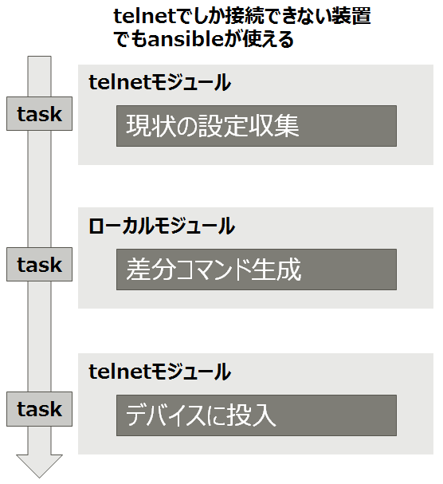

<!-- markdownlint-disable MD012 -->

# Ansibleローカルモジュール

<br>

Takamitsu IIDA (@takamitsu-iida)

---

## ネットワーク系モジュール

設定を変更するモジュールは次の動作を行う

1. リモートデバイスに接続
1. 設定情報を採取
1. 差分設定を生成
1. リモートデバイスに設定を投入

---

## ネットワーク系モジュール

- モジュールの中で全ての処理を完結


---

## 装置がないと利用できない

- 事前に検証機器が必要
- 以前採取したコンフィグを持っていても活用できない

---

## 入力パラメータがイマイチ

- 複数の状態をモジュールに入力するのに使う **aggregate** 指定がちょっと分かりづらい

---

## こうあってほしい

- 事前に採取しておいたコンフィグと比較して差分コマンドを生成したい


---

## ローカルモジュール

- コアモジュールの改造は難しそう
- 差分コマンドを生成するだけのモジュールを作成
- ローカルホストだけで完結するのでローカルモジュールと呼ぶ

---

## プレイブック利用



---

## モジュールへの入力（１）

装置の設定情報を入力

- **running_config** 既存の設定を文字列で指定
- **running_config_path** ファイルを指定

```yaml
tasks:
  - name: create config to be pushed
    ios_interface_local:
      running_config: "{{ running_config }}"
      interfaces: "{{ interfaces }}"
    register: r
```

---

## モジュールへの入力（２）

- 希望する設定の状態をYAMLで入力
- リストなので同時に複数を指定可能

```yaml
interfaces:

  - name: GigabitEthernet3
    description: configured by ansible
    negotiation:
    speed:
    mtu: 1500
    shutdown: false
    state: present
```

---

## モジュールからの出力

- **commands** 流し込むコマンドをリストで返却

```bash
"commands": [
    "interface GigabitEthernet3",
    "no description",
    "description configured by ansible",
    "mtu 1512",
    "interface GigabitEthernet4",
    "no negotiation auto",
    "speed 1000",
    "interface Loopback0",
    "description configured by ansible",
    "shutdown"
]
```
